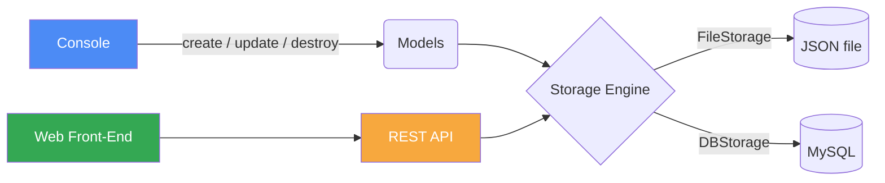

<div align="center">

<!-- Animated header banner -->


<!-- Typing animation -->
<a href="https://github.com/nesruzenu/AirBnB_clone">
  
</a>

<br/>

<!-- Badges -->


</div>

<br/>

## 📖 Table of Contents

- [About the Project](#-about-the-project)
- [Architecture](#-architecture)
- [Tech Stack](#-tech-stack)
- [Project Structure](#-project-structure)
- [Getting Started](#-getting-started)
- [Usage](#-usage)
- [Command Reference](#-command-reference)
- [Testing](#-testing)
- [Roadmap](#-roadmap)
- [Contributing](#-contributing)
- [Authors](#-authors)
- [License](#-license)

<br/>

## 🏡 About the Project

> This project is the beginning of a series of projects aimed at recreating the
> **AirBnB** platform end-to-end — from a simple command-line console, all
> the way to a fully deployed web application with a REST API and a dynamic
> front-end.

<div align="center">

</div>

The project is built incrementally, mirroring how real production systems evolve:

| Stage | Component            | Description                                                |
|:-----:|-----------------------|-------------------------------------------------------------|
| 0️⃣    | **Console**            | A command interpreter to manage app objects                 |
| 1️⃣    | **Storage Engine**     | Serializes/deserializes objects to/from a JSON file          |
| 2️⃣    | **Web Static**         | Hand-built HTML/CSS front-end mockups                        |
| 3️⃣    | **MySQL Storage**      | Swaps the storage engine for a relational database           |
| 4️⃣    | **Web Framework**      | Deploys a dynamic, templated front-end                       |
| 5️⃣    | **REST API**           | Exposes all objects over a documented HTTP API                |
| 6️⃣    | **Web Dynamic**        | Connects the front-end live to the API                       |

<br/>

## 🧱 Architecture



<br/>

## 🛠 Tech Stack

<div align="center">

</div>

<br/>

## 📂 Project Structure

<details>
<summary>Click to expand full file tree</summary>

```
AirBnB_clone/
├── console.py                 # Entry point of the command interpreter
├── models/
│   ├── __init__.py
│   ├── base_model.py          # BaseModel: id, created_at, updated_at, save/reload
│   ├── user.py
│   ├── state.py
│   ├── city.py
│   ├── amenity.py
│   ├── place.py
│   ├── review.py
│   └── engine/
│       ├── __init__.py
│       └── file_storage.py    # Serializes instances to a JSON file
├── tests/
│   ├── test_models/
│   └── test_console.py
├── AUTHORS
├── README.md
└── requirements.txt
```

</details>

<br/>

## 🚀 Getting Started

### Prerequisites


### Installation

```bash
# 1. Clone the repository
git clone https://github.com/nesruzenu/AirBnB_clone.git

# 2. Move into the project directory
cd AirBnB_clone

# 3. (Optional) create a virtual environment
python3 -m venv venv && source venv/bin/activate

# 4. Give the console executable permissions
chmod +x console.py
```

<br/>

## 💻 Usage

### Interactive mode

```bash
$ ./console.py
(hbnb) help

Documented commands (type help <topic>):
========================================
EOF  help  quit

(hbnb) quit
$
```

### Non-interactive mode

```bash
$ echo "help" | ./console.py
(hbnb)
Documented commands (type help <topic>):
========================================
EOF  help  quit
(hbnb)
$
```

<br/>

## 📋 Command Reference

| Command    | Syntax                                   | Description                                    |
|------------|-------------------------------------------|-------------------------------------------------|
| `create`   | `create <Class>`                          | Creates a new instance, saves it, prints its id |
| `show`     | `show <Class> <id>`                       | Prints the string representation of an instance |
| `destroy`  | `destroy <Class> <id>`                     | Deletes an instance based on class name and id  |
| `all`      | `all [Class]`                              | Prints all instances, optionally filtered       |
| `update`   | `update <Class> <id> <attribute> <value>`  | Updates an instance's attribute                 |
| `quit`     | `quit`                                      | Exits the console                               |
| `EOF`      | `Ctrl+D`                                   | Exits the console                               |

**Example:**

```bash
(hbnb) create User
49faff9a-6318-451f-87b6-910505c55907

(hbnb) show User 49faff9a-6318-451f-87b6-910505c55907
[User] (49faff9a-6318-451f-87b6-910505c55907) {'id': '49faff9a-...', 'created_at': ..., 'updated_at': ...}

(hbnb) destroy User 49faff9a-6318-451f-87b6-910505c55907
(hbnb)
```

<br/>

## 🧪 Testing

```bash
python3 -m unittest discover tests
```

<div align="center">


</div>

<br/>

## 🗺 Roadmap

- [x] Command interpreter (console)
- [x] BaseModel + serialization
- [x] FileStorage engine
- [ ] Web static HTML templates
- [ ] MySQL storage engine
- [ ] Web framework (dynamic templates)
- [ ] REST API
- [ ] Full front-end/back-end integration

<br/>

## 🤝 Contributing

Contributions are welcome! Please fork the repo and open a pull request, or
open an issue to discuss what you'd like to change.

```bash
git checkout -b feature/your-feature-name
git commit -m "Add: short description of change"
git push origin feature/your-feature-name
```

<br/>

## 👤 Authors

<div align="center">

<a href="https://github.com/nesruzenu">
  
</a>

**Nesru Zenu**
[](https://github.com/nesruzenu)

</div>

See the [AUTHORS](AUTHORS) file for the full list of contributors.

<br/>

## 📄 License

This project is licensed under the MIT License — see the `LICENSE` file for details.

<br/>

<div align="center">


⭐️ If you found this project interesting, consider giving it a star!
</div>
